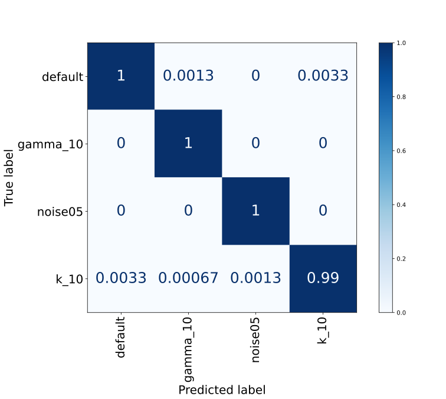
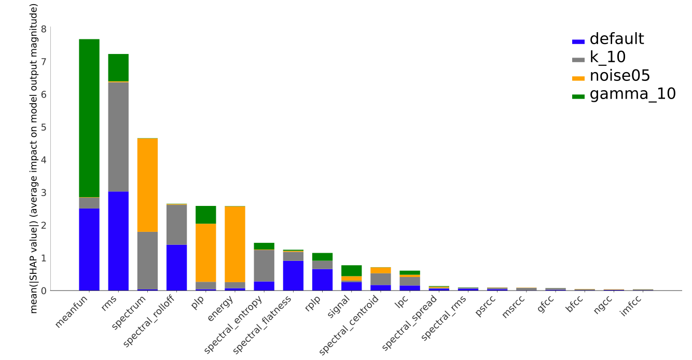
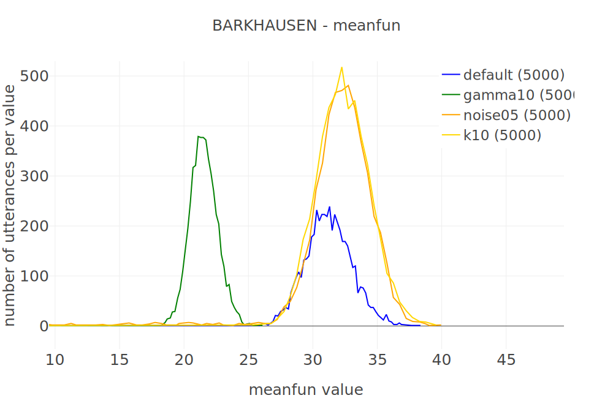
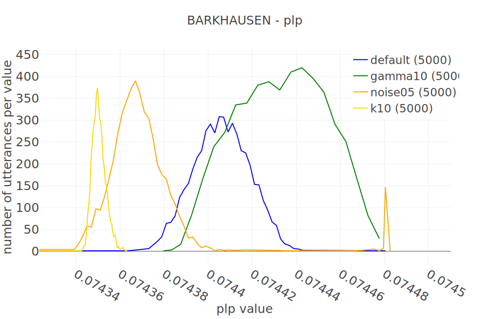
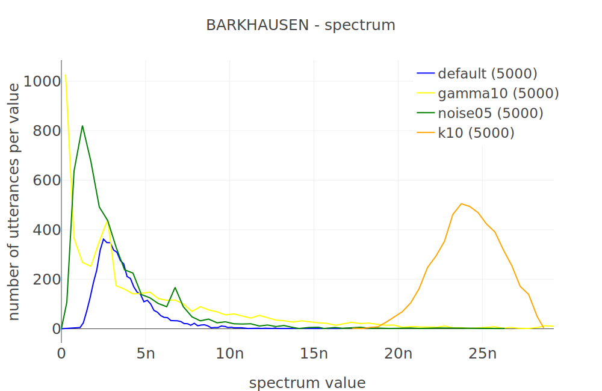
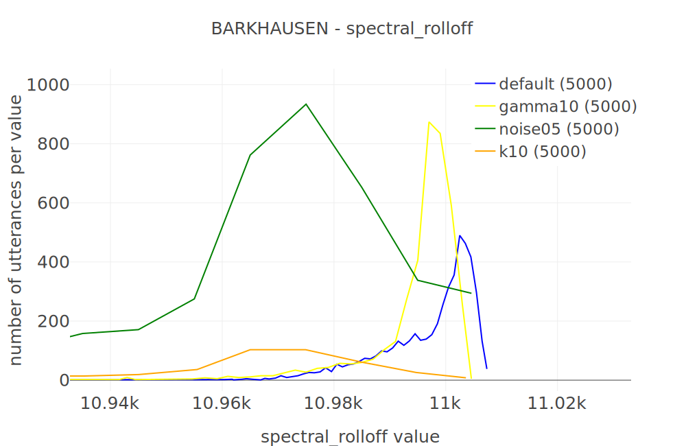
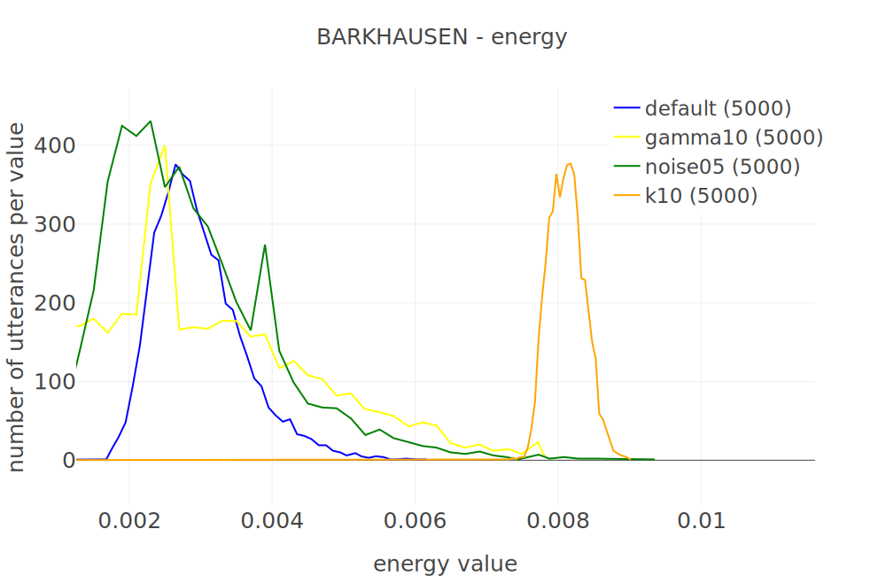

# Barkhausen experiments

### Results

Barkhausen 5k samples (default, noise05, gamma10, k10)

| model | accuracy per class |
| ----- | ------------------ |
| CART  | 98.949             |
| RFC   | 99.316             |
| ETC   | 99.566             |
| GBC   | 99.6               |
| HGBC  | 99.783             |
| ADC   | 96.883             |

best: **HGBC**

HGBC Confusion matrix:



HGBC SHAP values:



### Barkhausen dataset features graphs

### [Meanfun](https://unict-fake-audio.github.io/audio-datasets-overview/#/datasets?feature=meanfun&system_id=A01_A06&speaker=LA_0069&feature_per_speaker=0&dataType=0&dataset=BARKHAUSEN&algorithm=false)



### [RMS](https://unict-fake-audio.github.io/audio-datasets-overview/#/datasets?feature=rms&system_id=A01_A06&speaker=LA_0069&feature_per_speaker=0&dataType=0&dataset=BARKHAUSEN&algorithm=false)


### [Perceptual Linear Prediction (plp)](https://unict-fake-audio.github.io/audio-datasets-overview/#/datasets?feature=plp&system_id=A01_A06&speaker=LA_0069&feature_per_speaker=0&dataType=0&dataset=BARKHAUSEN&algorithm=false)



<!-- ### [Spectrum](https://unict-fake-audio.github.io/audio-datasets-overview/#/datasets?feature=spectrum&system_id=A01_A06&speaker=LA_0069&feature_per_speaker=0&dataType=0&dataset=BARKHAUSEN&algorithm=false)

 -->

<!-- ### [Spectral_rolloff](https://unict-fake-audio.github.io/audio-datasets-overview/#/datasets?feature=spectral_rolloff&system_id=A01_A06&speaker=LA_0069&feature_per_speaker=0&dataType=0&dataset=BARKHAUSEN&algorithm=false)

 -->

<!-- ### [Energy](https://unict-fake-audio.github.io/audio-datasets-overview/#/datasets?feature=energy&system_id=A01_A06&speaker=LA_0069&feature_per_speaker=0&dataType=0&dataset=BARKHAUSEN&algorithm=false) -->

<!--  -->

## How to run the same experiment

### Install

Use a python virtual env (strongly recommended) and install all the requirements:

```bash
pip install -r requirements.txt
```

### Usage

```bash
python3 run_experiment.py
```

The script will load the saved model `hgbc_barkhausen.sav`
